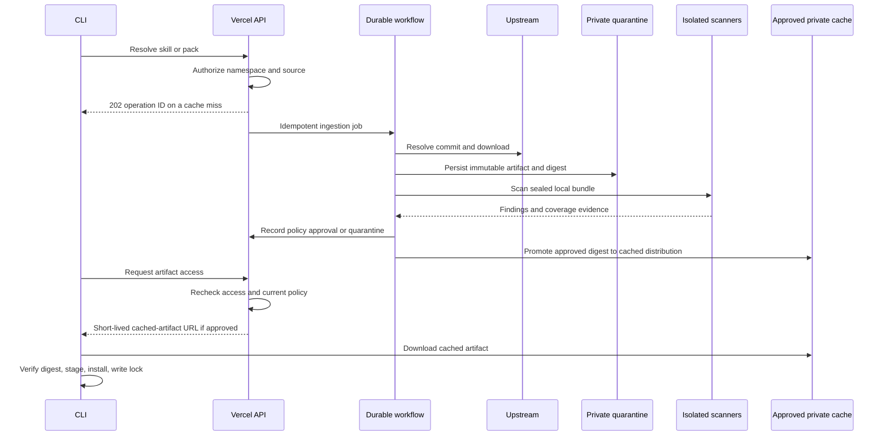

# Private Skills

A private registry, pull-through proxy, and cross-platform installer for AI agent skills and curated skill packs.

**Status: implementation plan, 9 September 2026.** This repository contains the product design and implementation backlog. The server, CLI, and scanner integrations are not implemented or deployed yet. Example commands and manifests describe the proposed v1 interface.

## What we are building

- An authenticated web app and API deployable to Vercel, with private namespaces, skill versions, packs, access control, scan reports, and audit history.
- A standalone `pskills` CLI for Windows, macOS, and Linux to publish, discover, install, update, verify, and remove skills and packs.
- A pull-through proxy: resolve an upstream reference, download the complete skill into private storage, scan those exact bytes, then serve the cached artifact to authorized clients.
- Immutable versions and lockfiles so a pack installs the same skills everywhere.
- Configurable scanner adapters and policy hooks. A missing, failed, or incomplete required scan cannot silently approve an artifact.

## Recommended design

| Area | Recommendation |
| --- | --- |
| Web and API | Next.js, TypeScript, Node runtime, Vercel Git deployments |
| Database | Managed PostgreSQL, initially Neon; migrations owned by the app |
| Private artifacts | Vercel Blob private store; scoped, short-lived signed URLs |
| Background work | Vercel Workflow for durable orchestration; short function steps |
| Untrusted input and scanners | Disposable Vercel Sandbox instances with pinned scanner environments; executor abstraction permits a separate Linux worker later |
| CLI | Go, released as platform binaries; no Node/Python prerequisite for users |
| Interoperability | Standard Agent Skills directories containing `SKILL.md`; additive registry and pack metadata |
| Initial upstreams | Explicit GitHub repository/subdirectory mappings and another Private Skills registry; additional providers through adapters |

The web server deploys to Vercel. Scanning runs asynchronously in isolated compute, not inside a web request. Storage, database, workflow, and sandbox resources are additional services with their own usage costs. Free scanner software does not make hosting free.

## Read the plan

1. [Product scope and user journeys](docs/product.md)
2. [Architecture, storage, deployment, and operations](docs/architecture.md)
3. [Proxy behavior and trust rules](docs/proxy.md)
4. [CLI, skill formats, packs, and locks](docs/cli-and-packs.md)
5. [Scanner research and the three recommended adapters](docs/scanners.md)
6. [Scanner and policy hook contracts](docs/scanning-and-hooks.md)
7. [API and data model](docs/api-and-data.md)
8. [Implementation milestones and acceptance tests](docs/implementation.md)

Illustrative JSON is in [examples](examples/README.md). Draft schemas are in [contracts](contracts/README.md).

## Core flow

Repository content is private and is not being released under an open-source license at this stage. Third-party scanner licenses are evaluated separately in the scanner plan.
