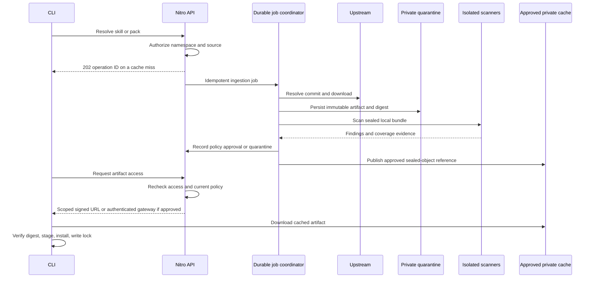

# Private Skills

A private registry, pull-through proxy, and cross-platform installer for AI agent skills and curated skill packs.

**Status: implementation plan, 9 September 2026.** This repository contains the product design and implementation backlog. The server, CLI, and scanner integrations are not implemented or deployed yet. Example commands and manifests describe the proposed v1 interface.

## What we are building

- An authenticated TanStack web app and Nitro API deployable across Nitro server hosting targets, including Vercel, with private namespaces, skill versions, packs, access control, scan reports, and audit history.
- A standalone `pskills` CLI for Windows, macOS, and Linux to publish, discover, install, update, verify, and remove skills and packs.
- A pull-through proxy: resolve an upstream reference, download the complete skill into private storage, scan those exact bytes, then serve the cached artifact to authorized clients.
- Immutable versions and lockfiles so a pack installs the same skills everywhere.
- Configurable scanner adapters and policy hooks. A missing, failed, or incomplete required scan cannot silently approve an artifact.

## Recommended design

| Area | Recommendation |
| --- | --- |
| Web and API | TanStack Start/Router with React and TypeScript; Nitro server and deployment adapters |
| Database | PostgreSQL behind a runtime-compatible persistence transport; self-hosted or managed |
| Private artifacts | Files SDK (`files-sdk`) with configurable backend adapters and capability-aware private transfers |
| Background work | Portable durable job contract; PostgreSQL-backed dispatcher/worker is the baseline, managed workflow adapters optional |
| Untrusted input and scanners | Disposable isolated scan environments via a portable executor; self-hosted worker or managed sandbox |
| CLI | Rust/Cargo, released as platform binaries; no compiler or language runtime prerequisite for users |
| Interoperability | Standard Agent Skills directories containing `SKILL.md`; additive registry and pack metadata |
| Initial upstreams | Explicit GitHub repository/subdirectory mappings and another Private Skills registry; additional providers through adapters |

Hosting portability is a core requirement. The web/API targets every server-capable Nitro deployment preset; static-only output needs a separately deployed API. Files SDK is the application storage boundary. Provider-specific dependencies remain in adapters, and an authenticated transfer gateway covers storage backends without private signed URLs. Scanning runs in separate compute so edge/serverless hosts do not need subprocesses or durable disks. Vercel is one supported deployment profile; Vercel Blob, Workflow, Sandbox, and Neon are optional integrations. Compatibility is proven per runtime/backend combination during implementation, not assumed from a shared interface.

## Read the plan

1. [Product scope and user journeys](docs/product.md)
2. [Architecture, storage, deployment, and operations](docs/architecture.md)
3. [Proxy behavior and trust rules](docs/proxy.md)
4. [CLI, skill formats, packs, and locks](docs/cli-and-packs.md)
5. [Scanner research and the three recommended adapters](docs/scanners.md)
6. [Scanner and policy hook contracts](docs/scanning-and-hooks.md)
7. [API and data model](docs/api-and-data.md)
8. [Implementation milestones and acceptance tests](docs/implementation.md)
9. [Files SDK storage, transfers, and backend portability](docs/storage.md)

Illustrative JSON is in [examples](examples/README.md). Draft schemas are in [contracts](contracts/README.md).

## Core flow

Repository content is private and is not being released under an open-source license at this stage. Third-party scanner licenses are evaluated separately in the scanner plan.
