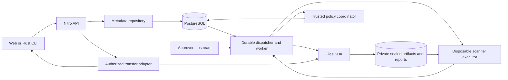

# Architecture and operations

This is the proposed v1 architecture, researched on 9 September 2026. The application, integrations, and deployments are not implemented. Hosting portability and Files SDK storage are requirements; compatibility must be demonstrated for each runtime and backend combination.

## Components and portability boundary

| Component | Responsibility |
| --- | --- |
| TanStack Start/Router, React, TypeScript | Private UI, browser navigation, typed data loading |
| Nitro | Versioned API, authentication, authorization, catalog, policy decisions, deployment adapters |
| PostgreSQL through a metadata repository | ACLs, immutable releases/packs, leases, outbox, policies, evidence indexes, audit history |
| Files SDK through a storage adapter | Private uploads, sealed archives, scan reports, authorized transfers |
| Portable dispatcher and worker | Durable acquisition/scan jobs, retries, cancellation, recovery |
| Disposable scanner executor | Isolated native Linux environments for pinned scanners |
| Rust `pskills` CLI | Native Windows/macOS/Linux publish, resolution, verification, installation, packs, update/removal |

Start with one organization per deployment, but include organization identity in database keys, authorization, storage paths, and jobs. Shared versioned JSON schemas connect TypeScript and Rust. Domain contracts do not import hosting-provider SDKs.

The web/API targets every **server-capable Nitro preset**. Use Web `Request`/`Response`, streams, `fetch`, and Web Crypto in shared request paths. Put native database drivers, filesystem operations, subprocesses, and provider bindings behind runtime adapters. A static-only build can serve the UI with a separately deployed API; it cannot run an authenticated registry itself. Nitro generates provider-specific outputs from a common codebase; its standalone Node output runs in containers or conventional servers. [Nitro deployment](https://nitro.build/deploy), [Node output](https://nitro.build/deploy/runtimes/node).

## Persistence and transfers

PostgreSQL is self-hosted or managed. Node deployments use a bounded native connection pool. Edge deployments use a compatible transport or an authenticated HTTP transaction service implementing named repository operations, not arbitrary client SQL. Preserve transaction, conditional-update, and uniqueness guarantees across transports. Optional Cloudflare Hyperdrive connects Workers to ordinary PostgreSQL; Neon is not required. [Hyperdrive PostgreSQL support](https://developers.cloudflare.com/hyperdrive/examples/connect-to-postgres/).

Files SDK is the object-storage boundary. Choose a backend at deployment time; see [storage contracts](storage.md). Validate capabilities and private access rather than assuming every backend offers signed URLs, atomic copies, or conditional writes. Where supported, issue a grant limited to one object, operation, and expiration. Otherwise use an authenticated streaming gateway with an expiring, narrowly scoped transfer grant distinct from the CLI's registry session credential. A permanent public URL cannot substitute for private delivery. [Files SDK capabilities](https://files-sdk.dev/docs/capabilities).

Uploads receive a random quarantine destination. Trusted inspection determines size, digest, and content; client claims are advisory. Download grants authorize an approved immutable object and expire within 60 seconds. Large transfers may bypass the control API through private storage grants or a dedicated gateway. Enforce product limits in every path, including signed-upload finalization.

For Nitro v3, use Files SDK core behind a thin Web Request/Response handler. The documented `files-sdk/nitro` binding targets Nitro v2/h3 v1; do not assume v3 compatibility. [Files SDK Nitro binding](https://files-sdk.dev/docs/ui/server/nitro).

## Acquisition, sealing, and scanner isolation

A cache miss creates a job and returns `202 Accepted` with an operation ID. Fully download the candidate before scanning or distribution; never redirect clients to upstream bytes. Nitro `routeRules.proxy` forwards traffic and can become a CDN rewrite on Vercel; it does not implement this package-proxy contract. [Nitro proxy rules](https://nitro.build/deploy/providers/vercel). See [source identity and cache rules](proxy.md).

The trusted acquisition worker receives narrowly scoped source/storage credentials. It resolves immutable upstream identity, validates archive paths and extraction limits, and builds the final deterministic archive without executing repository code. Any normalization happens **before sealing**; retain original and distribution digests when they differ.

Persist the final archive under a fresh random object key, verify complete bytes and digest, then seal it against further writes before scanning. The digest indexes content; the random immutable object identity prevents a shared mutable pathname becoming the approval target. Every scanner receives the same sealed archive and independently checks its digest. There is no post-scan archive rewriting. Approval changes database visibility and evidence state, not bytes. If a physical copy is required, verify and seal the destination before scanning and approve that exact object.

Run scanners in fresh disposable native Linux environments, separate from the trusted worker. Provide read-only input where supported and a bounded writable report directory. Scanners receive no database credentials, source tokens, broad storage credentials, or unrelated tenant data. Worker-mediated transfer and report collection keep those credentials outside scanner processes. Scanners cannot publish, edit sealed storage, or grant access.

The executor contract covers start/status/cancel, bounded logs, report retrieval, deadlines, and cleanup. The baseline uses an OCI container worker with isolated per-scan execution; hardened deployments may use VM isolation. Reusable images contain pinned trusted tools, never retained customer artifacts. Deny egress by default; cloud/LLM profiles permit only disclosed policy-approved destinations. Never execute skill scripts, install their dependencies, or run lifecycle hooks.

External execution enables edge hosting: Workers exposes `node:child_process` as a nonfunctional stub, so compatibility shims cannot run native scanners. [Workers runtime support](https://developers.cloudflare.com/workers/runtime-apis/nodejs/). See [scanner hooks and coverage](scanning-and-hooks.md).

## Durable jobs and approval

Create each job and outbox row in one PostgreSQL transaction. A dispatcher claims pending entries; workers claim expiring stage leases with fencing tokens and bounded heartbeats. Persist attempts, executor handles, artifact identity, and policy revisions before advancing. Stale or cancelled workers cannot finalize results. Recovery retries undispatched events and abandoned stages; bounded backoff distinguishes transient infrastructure failures from permanent validation failures.

Use idempotency keys and conditional transitions for acquisition, scanner attempts, report ingestion, and publication. Jobs never depend on an open HTTP request, in-memory queue, local API disk, or provider callback surviving. The worker can run beside the Node API or independently while Nitro runs on serverless/edge infrastructure.

The trusted policy coordinator validates report schema, authenticated job identity, sealed-object digest, scanner revision/configuration, and expected coverage. Inside the approval transaction, recheck policy, namespace permissions, cancellation, and revocation. Required timeouts, incomplete results, and engine errors deny distribution. Immutable releases reference the exact scanned object and evidence.

Files SDK lifecycle hooks are observability hooks: they are not awaited and cannot fail their observed operation. Enforce scanning through explicit durable stages and approval checks. [Hook semantics](https://files-sdk.dev/docs/api/onaction).

## Access and revocation

Browser login establishes identity; organization membership and namespace permissions authorize actions. Preserve [product roles](product.md), including separately controlled exception approval. CLI tokens are registry-issued, scoped, and revocable; upstream credentials remain server-side.

Authorize metadata, search, reports, jobs, and every transfer grant. Bind approvals/grants to immutable release/source identity, digest, current effective policy, and pack version/manifest context where applicable. Equal bytes in another namespace never inherit access. Before activation, the CLI revalidates its whole plan, including aggregate pack decisions and retained members.

Revocation immediately blocks new resolutions and grants. Existing grants may work for their remaining lifetime, at most 60 seconds; final install authorization also has a bounded race with local activation. Offline installed copies cannot be recalled. Report revocation on the next online check without exposing private artifact existence to unauthorized callers.

## Operations and deployment profiles

Initial caps are 25 MiB compressed, 100 MiB expanded, 2,000 files, 10 MiB per file, 100:1 expansion, and a separate 100 MiB repository acquisition ceiling. Start with two concurrent jobs per organization and ten-minute scanner deadlines. Validate these assumptions against scanners and hosts. Payload, duration, memory, transfer, and queue quotas vary; exhaustion produces pending/error states and never bypasses scanning.

Track queue age, stage duration, lease expiry, coverage, failures, grants, and storage growth using operation IDs. Exclude credentials, signed URLs, contents, prompts, and raw excerpts from routine logs. PostgreSQL and Files SDK storage retain authoritative evidence independently of vendor workflow-history retention.

Proposed retention: 30 days for failed uploads, 90 days for unreferenced rejected candidates, and published-version lifetime plus one year for reports/audit evidence. Honor holds. Exclude published references, active jobs, and held objects from collection. Back up metadata and objects across a separate recovery boundary; restore into isolation and verify hashes, references, and policy evidence before serving.

Initial conformance requires actual deployments on **Node/container, Vercel, and Cloudflare Workers**. Run identical authenticated publish/install, proxy miss/hit, pack-lock, revocation, required-scan failure, retry, and recovery checks. Other server-capable Nitro targets remain portability goals and gain verified status through this suite. Nitro development runs on Node, so local success cannot certify edge output. Resolve Cloudflare credentials/bindings within the request lifecycle. [Deployment behavior](https://nitro.build/deploy), [Cloudflare preset](https://nitro.build/deploy/providers/cloudflare).

Vercel is an optional profile. Nitro deployment, optional Workflow orchestration, and Sandbox execution satisfy the same interfaces. The documented TanStack Workflow path uses `workflow/vite`; validate pinned versions. [TanStack on Vercel](https://vercel.com/kb/guide/deploy-a-tanstack-start-app-to-vercel), [Workflow integration](https://vercel.com/changelog/workflow-sdk-now-supports-tanstack-start). Prove Git integration with a real deployment reporting `source: git`.

Separate development, preview, and production identities, data, callbacks, and allowlists. Pin dependencies, scanner rules/images, compatibility dates, and CI actions. Use reviewed backward-compatible migrations and native Rust CLI tests on Windows, macOS, and Linux. Budget for compute, storage, backups, transfer, CI, and optional model calls; planning provisions no paid services. See [implementation gates](implementation.md).
