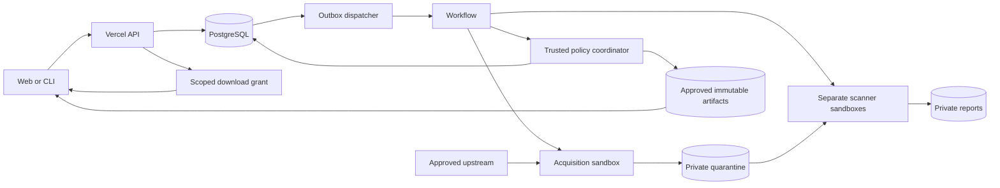

# Architecture and operations

This is the proposed v1 architecture, researched on 9 September 2026. The application, scanner integrations, hosted resources, and deployment pipeline are not implemented or provisioned. Initial operating limits are assumptions to validate during implementation.

## Components

| Component | Responsibility |
| --- | --- |
| Next.js and TypeScript, Node runtime on Vercel | Private web UI, versioned JSON API, browser authentication, CLI authorization, catalog, policy evaluation, download grants |
| Neon PostgreSQL | Organization boundaries, ACLs, immutable releases, packs, job state, policy revisions, scan evidence indexes, audit history |
| Private Vercel Blob | Quarantined inputs, immutable distribution archives, reports; separate quarantine and approved stores |
| Vercel Workflow | Durable orchestration through short, retryable steps and waits |
| Disposable Vercel Sandbox | Source acquisition and separate scanner execution environments |
| Go `pskills` CLI | Native Windows/macOS/Linux login, publish, resolution, download verification, installation, packs, updates, removal |

Start with one organization per deployment while including organization IDs in database keys, authorization, object paths, and jobs. The web server is the control plane; it does not run skill scripts or scanner binaries. Shared versioned JSON schemas connect TypeScript and Go. Storage and executor interfaces allow another object store or a separate Linux worker later without changing the CLI protocol.

## Platform constraints and transfers

Current Vercel Functions limits list a 4.5 MB request/response payload, 300-second Hobby maximum, and 800-second generally available Pro/Enterprise maximum. An 1800-second extension is beta and requires specific runtime configuration. Standard bundles allow 250 MB, or 500 MB for Python; 5 GB bundles are beta. Memory is 2 GB on Hobby and up to 4 GB on Pro/Enterprise. Keep the API small and avoid depending on beta extensions. Streamed responses still consume invocation lifetime. [Functions limits, updated 24 August 2026](https://vercel.com/docs/functions/limitations).

Archive transfers use private Blob directly. After authenticating and authorizing the user, the API grants PUT access to one random quarantine pathname with size restrictions. Completion triggers server-side inspection and hashing; client claims are not authoritative. Readers receive a server-generated GET URL for one approved digest, valid for 60 seconds. Explicitly scope path, operation, and expiration; never expose store credentials or signing material. Private signed transfers support these restrictions, and PUT grants support content-type and maximum-size constraints. [Signed URLs](https://vercel.com/docs/vercel-blob/vercel-signed-urls). Private Blob and OIDC authentication are generally available. [GA announcement](https://vercel.com/changelog/vercel-private-blob-is-now-generally-available).

An acquisition job fully downloads and stores a candidate before scanning. The API returns `202 Accepted` and an operation ID while work remains pending. It never redirects clients to upstream bytes. See [proxy behavior](proxy.md) for canonicalization, source identity, mutable references, and cache rules.

## Acquisition, sealing, and scanning

Acquisition and scanning have separate trust boundaries. The acquisition sandbox receives narrowly scoped access to an approved GitHub repository or Private Skills registry. Its egress permits only the configured source and storage endpoints. It downloads archives without executing repository code, enforces extraction limits, validates the selected directory, and produces a deterministic distribution archive. Preserve original and distribution digests when normalization changes bytes.

The trusted coordinator seals the stored distribution object by digest. Each scanner receives that exact bundle in a fresh sandbox from a pinned, trusted environment. Expose input read-only where supported, with a separate writable reports directory; independently verify its digest. A scanner cannot edit the distributed object, issue download grants, or approve a release. No production database credentials, source tokens, full object-store credentials, or unrelated organization data enter its VM.

Static scanning starts with egress denied. Explicit cloud/LLM modes allow only policy-approved endpoints and disclose that content will leave the registry. Where supported, broker credentials through network headers instead of environment variables. Vercel supports egress restrictions and credential injection outside the VM boundary. [Sandbox credential brokering](https://vercel.com/changelog/safely-inject-credentials-in-http-headers-with-vercel-sandbox). Never execute uploaded scripts, dependency installation, or lifecycle hooks.

Use ephemeral instances explicitly: persistence must not retain one customer's bundle for later scans. Only trusted scanner dependencies belong in reusable images. The executor contract covers start, status, cancellation, logs, report retrieval, and cleanup; a later external worker must implement equivalent isolation and job authentication. Detailed findings, coverage, engine errors, and policy gates follow [scanner hooks](scanning-and-hooks.md).

## Durable jobs and publication

Create the job and outbox event in one database transaction. A dispatcher starts its Workflow and marks dispatch only after recording the run identifier. Repeated dispatch is expected: job uniqueness, stage idempotency keys, and conditional updates prevent duplicate publication. A scheduled recovery pass retries undispatched outbox entries and identifies abandoned jobs.

Workers claim expiring stage leases with fencing tokens, send bounded heartbeats, and lose authority when the lease expires. Stale workers cannot finalize results. Persist operation, sandbox, command, attempt, artifact, and policy identifiers before advancing. Limit retries with backoff and distinguish transient provider errors from permanent validation failures. Cancellation revokes the lease and prevents approval even if a late result arrives.

Workflow offers persistent steps, retries, sleeps, and external-event hooks. [Workflow concepts](https://vercel.com/docs/workflows/concepts). Its complete run has no duration limit, but each step inherits Function limits. Start detached sandbox commands, persist identifiers, then poll through short steps separated by durable waits; do not hold a Function open for the whole scan. [Detached execution example](https://vercel.com/kb/guide/run-claude-managed-agent-tools-with-vercel-sandbox).

The trusted policy coordinator validates report schema, job identity, artifact digest, scanner configuration, expected coverage, and callback authentication. It rechecks current policy, namespace permissions, and revocation inside the approval transaction. Required timeouts, incomplete scans, or errors cannot become a pass. Publishing creates an immutable version pointing to an approved object; no scanner has this authority.

## Access and revocation

Browser login identifies a user; organization membership and namespace permissions separately authorize actions. Follow [product roles](product.md): owner, administrator, publisher, reader, and narrowly scoped scanner service identity. A publisher does not obtain exception-approval authority implicitly. CLI credentials are registry-issued, revocable, and distinct from upstream credentials. GitHub App installations provide organization-managed mirror access, as defined in the proxy policy.

Authorize metadata, search, reports, job status, and each download-grant request. Bind approvals/grants to immutable release/source identity and pack version/manifest where applicable, as well as digest and current effective policy. Identical bytes under another namespace do not inherit access. Before activation, the CLI revalidates the whole plan through the install authorization endpoint, including aggregate pack decisions and retained members. Avoid revealing private artifact existence through unauthorized responses. Revocation immediately denies new grants and resolutions, including pack members. Already-issued signed grants may work for up to their 60-second lifetime; a final authorization also has a bounded race with local activation. Installed offline copies cannot be recalled. The CLI reports revocation on its next online check.

## Operating limits, evidence, and recovery

Initial product caps are 25 MiB compressed bundles, 100 MiB expanded, 2,000 files, 10 MiB per file, 100:1 expansion, and a separate 100 MiB repository acquisition ceiling. Start with two concurrent jobs per organization and ten-minute per-scanner deadlines; validate scanner-specific requirements in the spike. These are application assumptions, not provider promises. Sandbox currently allows 45-minute Hobby sessions and 24-hour Pro/Enterprise sessions; quota exhaustion must produce pending/error states rather than bypassing scans. [Sandbox quotas](https://vercel.com/docs/sandbox/pricing).

Track queue age, fetch/scan duration, retries, lease expiry, scanner coverage/errors, rejection rates, cache hits, download grants, and storage growth. Correlate through operation IDs. Keep tokens, signed URLs, skill contents, prompts, and raw report excerpts out of routine logs. Store bounded reports privately with explicit access control and an append-only audit history for policy, exception, publication, and revocation decisions.

Persist required evidence in PostgreSQL and Blob. Workflow history is retained after completion for only 1/7/30 days on Hobby/Pro/Enterprise and is unsuitable as the permanent audit record. [Workflow retention and limits](https://vercel.com/docs/workflows/pricing). Proposed retention: 30 days for failed temporary uploads, 90 days for unreferenced rejected candidates, and the lifetime of a published version plus one year for its reports and audit evidence. Administrators can extend retention or apply legal/security holds.

Enable database backups and object inventory/export backups to a separate recovery boundary. Keep published artifacts, pack references, active jobs, and retention holds outside routine garbage collection. Define recovery objectives during the deployment spike, then test restoration into an isolated environment, verify artifact hashes and references, and prove that restored policy never approves missing evidence. Provider backup availability alone is not a restore test.

## Delivery and rollout

Use separate development, preview, and production databases, stores, OAuth callbacks, service identities, and source allowlists. Previews receive synthetic fixtures and no production source credentials. Apply reviewed migrations as a controlled deployment stage; use backward-compatible schema changes so rollback remains possible. Pin runtime dependencies, scanner revisions/rules/images, and CI actions.

Roll out through protocol/storage and isolation spikes, authenticated private publish/install, proxy caching, immutable packs, scanner calibration, required policies, then operational hardening. CI must exercise native CLI behavior on Windows, macOS, and Linux; archive attacks, access boundaries, retry recovery, policy changes, revoked artifacts, and scanner failures need integration coverage.

Release acceptance includes a real Git-triggered Vercel deployment whose deployment metadata confirms `source: git`, authenticated end-to-end publish and install, a miss fully cached and scanned before delivery, a hit during upstream outage, reproducible pack locks, and denial under required scanner failure. Cross-compilation, local builds, or manually triggered deployments alone do not complete these gates. See [implementation milestones](implementation.md).

Budget for Vercel plan/Functions and transfer, PostgreSQL/storage/backups, private Blob operations and retention, Workflow/queue persistence, Sandbox compute/images, CI artifacts, and optional model/API calls. Measure representative jobs before estimating monthly spend; enforce concurrency, runtime, storage, and external-call budgets. Free scanner software does not imply free operation. Planning creates no hosted services or paid subscriptions.
